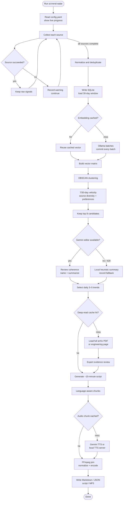

# AI Trend Radar

**English** | [简体中文](README_CN.md)

A lightweight, maintainable AI trend-detection pipeline. Instead of producing a daily pile of papers, it combines research, open-source, and engineering signals into **3–5 emerging trends**, attaches 1–2 must-read links to each trend, and generates a roughly 15-minute Chinese or English briefing with an optional MP3 episode.

The default editorial focus is LLMs, production engineering, and Efficient ML—especially inference, serving, quantization, KV cache, GPU kernels, distributed inference and training, MoE, speculative decoding, and agent infrastructure.

## Features

- Collects arXiv `cs.CL`, `cs.LG`, and `cs.AI`; `cs.CV` is optional.
- Collects Hugging Face Daily Papers, GitHub Trending, selected GitHub releases, and RSS/Atom engineering blogs.
- Normalizes all sources into one item model and deduplicates by arXiv ID, title, and URL.
- Stores a rolling 30-day history in SQLite.
- Supports local Ollama or Gemini embeddings with persistent content-addressed caching.
- Clusters topics with DBSCAN and compares the last 7 days with the preceding 23-day weekly baseline.
- Distinguishes new-signal-driven trends from continuing trends and cools down recently recommended links.
- Uses Gemini to review cluster coherence, reject mismatched or duplicate trends, name topics, rank candidates, and produce Chinese or English summaries.
- Deep-reads the full arXiv PDF or engineering page for the final 6–10 must-read items.
- Reviews mechanisms, experimental setup, baseline fairness, ablations, unproven claims, adoption prerequisites, and replication checks.
- Produces Markdown, JSON, a long-form spoken script, and optionally MP3 audio.
- Generates Chinese or English speech with language-specific voices, styles, and chunk sizes.
- Caches individual TTS chunks so interrupted episodes can resume without regenerating completed audio.
- Falls back across Gemini models and then to a local OpenAI-compatible Kokoro or Qwen TTS server.

## Architecture

```mermaid
flowchart LR
    subgraph sources["Signal sources"]
        A["arXiv<br/>cs.CL / cs.LG / cs.AI"]
        H["Hugging Face<br/>Daily Papers"]
        G["GitHub<br/>Trending / Releases"]
        R["Engineering blogs<br/>RSS / Atom"]
    end

    subgraph ingestion["Ingestion and storage"]
        C["Collectors<br/>source-level failure isolation"]
        U["Unified Item model<br/>cross-source deduplication"]
        DB[("SQLite<br/>30-day history + vector cache")]
    end

    subgraph intelligence["Trend detection"]
        EC{"Embedding<br/>cache hit?"}
        O["Ollama<br/>qwen3-embedding:0.6b"]
        V["1024-dimensional vectors"]
        CL["DBSCAN<br/>topic clustering"]
        TS["7/30-day scoring<br/>velocity + sources + preferences"]
    end

    subgraph editorial["Editorial and output"]
        GN["GeminiNarrator<br/>coherence + naming + summary"]
        DR["GeminiDeepReader<br/>full PDF / page<br/>evidence review"]
        SW["GeminiSpeechWriter<br/>~15-minute script"]
        HN["HeuristicNarrator<br/>local summary fallback"]
        HS["HeuristicSpeechWriter<br/>local script fallback"]
        TTS["Gemini / local TTS<br/>chunk cache"]
        MP3["FFmpeg<br/>join + loudness normalization"]
        OUT["Markdown + JSON<br/>script + MP3"]
    end

    A --> C
    H --> C
    G --> C
    R --> C
    C --> U --> DB
    DB --> EC
    EC -->|"hit"| V
    EC -->|"miss"| O --> V
    O -->|"write cache"| DB
    V --> CL --> TS --> GN --> DR --> SW --> TTS --> MP3 --> OUT
    GN -. "unavailable / quota" .-> HN --> DR
    DR -. "failure" .-> SW
    SW -. "unavailable / quota" .-> HS --> TTS
```



Ollama handles local semantic vectors. Local code owns statistics and clustering. Gemini performs editorial review, full-source analysis, and script writing. The selected TTS provider generates PCM/WAV chunks, while FFmpeg only joins, normalizes, and encodes the final MP3.

## Daily pipeline



Cache keys include the provider, model, dimensions or voice settings, language, and a content fingerprint. Changing a model, document, voice, style, or language automatically creates a new cache entry.

## Quick start

Requires Python 3.11+.

```bash
python -m venv .venv
source .venv/bin/activate
pip install -e '.[gemini]'
cp config.example.yaml config.yaml
cp .env.example .env
```

MP3 assembly also requires FFmpeg:

```bash
# macOS
brew install ffmpeg

# Ubuntu / Debian
sudo apt-get install ffmpeg
```

Add the Gemini API key to the local `.env` file. The project loads it at startup, never overrides a non-empty shell variable, and does not commit or print it.

```bash
# .env
GEMINI_API_KEY='your-key'

ai-trend-radar run --config config.yaml
```

You may instead export `GEMINI_API_KEY` in the shell; shell values take precedence.

Outputs are written to:

```text
reports/YYYY-MM-DD.md
reports/YYYY-MM-DD.json
reports/YYYY-MM-DD-script.md
reports/YYYY-MM-DD.mp3
reports/latest.md
reports/latest-script.md
reports/latest.mp3
```

Historical signals and the embedding cache live in `data/radar.db`.

## API calls and fallbacks

A normal online run uses:

- one request for candidate trend review;
- one request per uncached must-read item, typically 6–10;
- one request for the spoken script, with up to two rewrites when its duration is outside the target range;
- several TTS requests, determined by language and script length.

Text models are tried in configured order, normally:

```text
Gemini 3.7 Flash
→ Gemini 3 Flash Preview
→ Gemini 2.5 Flash
→ Gemini 3.5 Flash-Lite
```

The process remembers models that returned 429/`RESOURCE_EXHAUSTED` and avoids repeatedly hitting the same exhausted quota. Temporary 500/503 failures are retried before switching models.

The default TTS chain is:

```text
Gemini 3.1 Flash TTS
→ Gemini 2.5 Flash TTS
→ local Kokoro
```

Embedding uses Ollama by default and therefore consumes no Gemini quota. Deep-reading JSON and audio chunks are persistent; one failed source or cloud provider does not prevent the text report from being produced.

The Gemini integration uses `google-genai`, structured JSON output, and native PDF input. Gemini 3.1 TTS uses the newer Interactions API and requires `google-genai >= 2.0`. If the SDK reports that the legacy Interactions schema is unsupported, run:

```bash
pip install -e '.[gemini]'
```

## Generate audio only

When a script already exists, run TTS and MP3 assembly without collection, clustering, summarization, deep reading, or script generation:

```bash
ai-trend-radar audio --config config.yaml
```

By default this reads `reports/latest-script.md`, infers the date from the title, and writes both the dated MP3 and `reports/latest.mp3`.

Use a historical script or custom output path:

```bash
ai-trend-radar audio \
  --config config.yaml \
  --script reports/2026-08-20-script.md

ai-trend-radar audio \
  --config config.yaml \
  --script reports/2026-08-20-script.md \
  --output reports/custom-episode.mp3
```

The command uses the same chunk cache as the full pipeline, making it suitable for resuming after a 429, network interruption, or individual chunk failure.

## Offline sample

The bundled sample covers 30 days of papers, releases, trending repositories, and engineering-blog signals. It forces local providers, does not need an API key, skips audio, and uses isolated `data/radar-sample.db` and `reports/sample/` paths.

```bash
pip install -e .
ai-trend-radar run --sample --config config.example.yaml
```

See [`examples/sample-report.md`](examples/sample-report.md) for a generated example.

## Configuration

Copy and edit [`config.example.yaml`](config.example.yaml).

| Setting | Purpose |
|---|---|
| `collectors.arxiv.categories` | arXiv categories; add `cs.CV` for broader visual research |
| `github_releases.repositories` | Infrastructure repositories to monitor |
| `rss.feeds` | Engineering-team RSS/Atom feeds |
| `preferences.keywords` | Editorial preference weights; affects ranking, not hard filtering |
| `clustering.eps` | DBSCAN cosine distance; smaller values create tighter topics |
| `radar.top_trends` | Number of output trends, constrained to 3–5 |
| `radar.report_language` | Summary, deep-read, and report language: `zh-CN` or `en-US` |
| `radar.recommendation_cooldown_days` | Avoid recommending the same link for this many days |
| `embedding.cache` | Persistent embedding cache; normally keep enabled |
| `llm.models` | Text-model priority order |
| `deep_reading.enabled` | Read full PDFs/pages for final must-read items |
| `deep_reading.models` | Deep-reading model chain; normally reuses the text chain |
| `deep_reading.cache_dir` | Persistent full-source analysis cache |
| `deep_reading.max_pdf_bytes` | Maximum PDF download size; default 20 MB |
| `deep_reading.max_workers` | Bounded deep-reading workers; default 2, capped at 4 |
| `deep_reading.max_in_flight_per_model` | Maximum concurrent requests to one Gemini model |
| `speech.enabled` | Enable the daily spoken script |
| `speech.provider` | `same_as_llm`, `gemini`, or `heuristic` |
| `speech.target_minutes` | Target duration, default 15 minutes; allowed range 5–30 |
| `audio.provider` | `fallback`, `gemini`, or OpenAI-compatible `local_http` |
| `audio.language` | `same_as_report`, `zh-CN`, or `en-US` |
| `audio.providers[].voices` | Per-language voices, for example `{zh-CN: zf_xiaoxiao, en-US: af_heart}` |
| `audio.chunk_chars_by_language` | Chunk limits; default Chinese 700 and English 1800 characters |
| `audio.max_workers` | Gemini/fallback is forced to 1; direct local HTTP may use 2 |
| `audio.cache_dir` | WAV chunk cache directory |
| `audio.cache_days` | Delete chunks older than this many days; default 14 |

### Provider replacement

Provider interfaces are concentrated in [`src/ai_trend_radar/providers.py`](src/ai_trend_radar/providers.py):

- `embedding.provider: ollama`: local Ollama embeddings.
- `embedding.provider: gemini`: Gemini embeddings.
- `embedding.provider: local`: deterministic local `HashingVectorizer` fallback.
- `llm.provider: gemini`: Gemini trend review and summarization.
- `llm.provider: heuristic`: deterministic local summary fallback.
- `deep_reading.provider: gemini`: full PDF/page evidence review.
- `speech.provider: same_as_llm`: use the configured LLM provider.
- `speech.provider: heuristic`: fully local script fallback.
- `audio.provider: gemini`: Gemini TTS producing raw 24 kHz PCM.
- `audio.provider: fallback`: cloud models followed by local Kokoro.
- `audio.provider: local_http`: call `/v1/audio/speech` and expect WAV.

To add another vendor, implement `EmbeddingProvider.embed()`, `TrendNarrator.enrich()`, a deep-reading provider, `SpeechWriter.write()`, or `TTSProvider.synthesize()`. Collection, history, clustering, and report rendering do not need to change.

## Chinese and English output

Generate an entirely Chinese or English report and episode by changing one setting:

```yaml
radar:
  report_language: zh-CN  # or en-US

audio:
  language: same_as_report
```

The report and audio languages may also differ. Gemini rewrites the spoken script in the audio language:

```yaml
radar:
  report_language: zh-CN

audio:
  language: en-US
```

If Gemini script generation fails and the project falls back to the local heuristic writer, source fields are not machine-translated. For fully offline runs, keeping both languages equal is recommended.

Language-specific voice, style, and chunk configuration:

```yaml
audio:
  language: same_as_report
  voices: {zh-CN: zf_xiaoxiao, en-US: af_heart}
  styles:
    zh-CN: 语速平稳、清晰、自然，像专业科技播客主播。
    en-US: Calm, clear, natural delivery for a professional technology podcast.
  chunk_chars_by_language: {zh-CN: 700, en-US: 1800}
```

English periods, question marks, exclamation marks, and semicolons are treated as natural boundaries. Very short tail chunks are merged or rebalanced so a few remaining characters do not consume a separate TTS request.

## Local Kokoro TTS

The repository includes a pinned Docker Compose service bound only to `127.0.0.1:8880`:

```bash
docker compose -f deploy/kokoro/compose.yaml up -d
docker compose -f deploy/kokoro/compose.yaml ps
```

List voices and test Chinese synthesis:

```bash
curl http://127.0.0.1:8880/v1/audio/voices

curl http://127.0.0.1:8880/v1/audio/speech \
  -H 'Content-Type: application/json' \
  -d '{"model":"kokoro","voice":"zf_xiaoxiao","input":"这是本地语音合成测试。","response_format":"wav","speed":1.0}' \
  --output /tmp/kokoro-test.wav
```

Direct local configuration:

```yaml
audio:
  enabled: true
  language: same_as_report
  provider: local_http
  base_url: http://127.0.0.1:8880
  model: kokoro
  voices: {zh-CN: zf_xiaoxiao, en-US: af_heart}
  speed: 1.0
  timeout_seconds: 300
  max_workers: 2
```

Recommended quota-aware fallback configuration:

```yaml
audio:
  enabled: true
  language: same_as_report
  provider: fallback
  providers:
    - provider: gemini
      model: gemini-3.1-flash-tts-preview
      voices: {zh-CN: Charon, en-US: Charon}
    - provider: gemini
      model: gemini-2.5-flash-preview-tts
      voices: {zh-CN: Charon, en-US: Charon}
    - provider: local_http
      base_url: http://127.0.0.1:8880
      model: kokoro
      voices: {zh-CN: zf_xiaoxiao, en-US: af_heart}
  chunk_chars_by_language: {zh-CN: 700, en-US: 1800}
  pause_ms: 450
  bitrate: 128k
  cache_dir: data/audio-cache
  cache_days: 14
```

Stop or remove the local service:

```bash
docker compose -f deploy/kokoro/compose.yaml stop
docker compose -f deploy/kokoro/compose.yaml down
```

Kokoro Chinese female voices include `zf_xiaobei`, `zf_xiaoni`, `zf_xiaoxiao`, and `zf_xiaoyi`; male voices include `zm_yunjian`, `zm_yunxi`, `zm_yunxia`, and `zm_yunyang`. Changing language or voice creates a separate cache namespace.

## Ollama embeddings

The local configuration uses `qwen3-embedding:0.6b` through `http://127.0.0.1:11434/api/embed` to generate 1024-dimensional multilingual vectors.

```bash
ollama serve
ollama pull qwen3-embedding:0.6b
```

Ollama must remain running during the daily pipeline. Changing the embedding model, dimensions, or source text creates a new cache namespace.

## Trend scoring and editorial review

Each topic's base score combines:

1. signal count over the last 7 days;
2. total signal count over 30 days;
3. the last 7 days relative to the preceding 23-day weekly rate;
4. independent source count;
5. configured preference weights;
6. community attention such as Hugging Face upvotes or GitHub stars;
7. signals first observed today.

Must-read ranking favors new items and penalizes links recommended during the cooldown period. Gemini then reviews whether each cluster shares one technical problem, removes mismatched items and duplicate trends, and returns an allow-list of relevant URLs. It prefers independent paper, code/release, and engineering evidence when available, but never introduces an unrelated item merely for source diversity.

Gemini may adjust the explainable base score only within `[-1, 1]`. The report includes evidence, confidence, and current counterevidence or gaps. Titles, abstracts, PDFs, and web pages are treated as untrusted data; prompts explicitly prohibit following instructions contained inside them.

## Caching, concurrency, and retries

Embedding vectors are stored with historical signals in `data/radar.db`. Every successful embedding batch is committed immediately, so a later failure does not discard completed work.

Deep reading defaults to two bounded workers and never submits all papers at once. Quota and transient-unavailability state is shared between threads. After quota exhaustion, the scheduler stops submitting new work and waits only for requests already in flight. Deep-read JSON and WAV chunks use uniquely named temporary files followed by atomic replacement.

Retry diagnostics include the model, attempt number, concrete error, backoff delay, and model switch:

- temporary Gemini 500/503 failures: initial request plus 2 retries;
- invalid or truncated JSON: up to 3 complete rewrites;
- PDF or page timeout, 429, or 5xx: up to 3 attempts;
- 400, 403, 404, non-PDF responses, and files above the configured size limit are not retried blindly.

Gemini TTS and provider fallback chains remain serial because quota switching must be ordered. A direct local HTTP TTS provider may use two workers after verifying available RAM/VRAM. MP3 assembly always preserves original chunk order.

The 7/30-day velocity becomes more meaningful after 2–4 weeks of accumulated history.

## Daily automation

The repository includes [`.github/workflows/daily-radar.yml`](.github/workflows/daily-radar.yml). Add `GEMINI_API_KEY` to GitHub Actions secrets; `GH_RELEASES_TOKEN` is optional. The workflow caches SQLite history and uploads reports as artifacts.

Local cron example for 08:10 Perth time, assuming the machine uses that local timezone:

```cron
10 8 * * * cd /absolute/path/to/ai_trend && .venv/bin/ai-trend-radar run --config config.yaml >> data/cron.log 2>&1
```

## Development

```bash
pip install -e '.[dev,gemini]'
pytest
```

Core package layout:

```text
src/ai_trend_radar/
├── audio.py          # Gemini/local TTS, cache, and MP3 assembly
├── collectors.py     # Data sources and deduplication
├── deep_reading.py   # Full-source expert review
├── gemini_utils.py   # Quota-aware retries and model fallback
├── storage.py        # SQLite history and embedding cache
├── providers.py      # Ollama, Gemini, and local providers
├── trends.py         # Clustering and 7/30-day scoring
├── report.py         # Markdown, JSON, and script artifacts
└── pipeline.py       # End-to-end orchestration and fallbacks
```

## MVP limitations

- GitHub Trending has no stable official API; HTML changes may require selector updates. Its failure does not block other sources.
- arXiv and public websites enforce rate limits. Keep collection at a low daily frequency.
- Clusters are recomputed over the rolling 30-day window and do not yet maintain cross-day topic lineage.
- Sample links use `example.com` and validate the pipeline rather than represent real recommendations.
