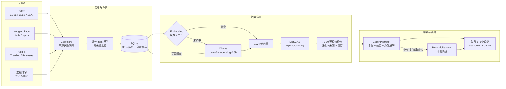
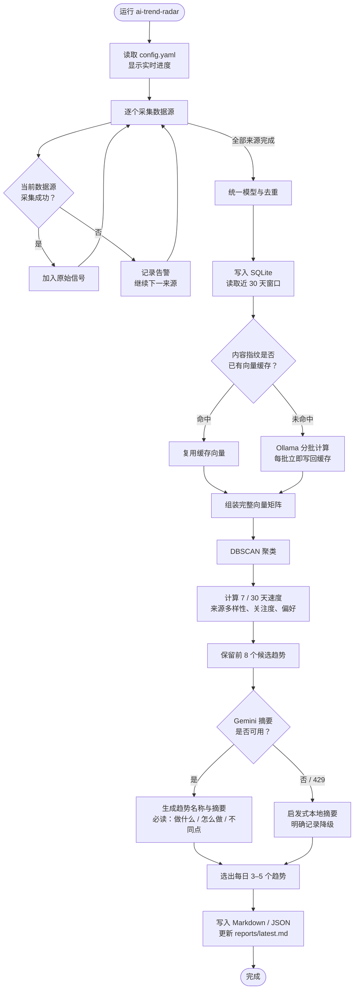

# AI Trend Radar

一个轻量、可维护的 AI 趋势检测 MVP。它不是每天堆一串论文，而是把研究、开源和工程信号聚合成 **3–5 个正在形成的趋势**，每个趋势附 1–2 个必读链接。

默认偏好：LLM、工程实践、Efficient ML，尤其是 inference、serving、quantization、KV cache、GPU kernel、distributed inference/training、MoE、speculative decoding 和 agent infrastructure。

## 能做什么

- 采集 arXiv `cs.CL / cs.LG / cs.AI`（可加入 `cs.CV`）
- 采集 Hugging Face Daily Papers
- 采集 GitHub Trending 和指定项目 releases
- 采集任意工程博客 RSS/Atom
- 统一数据模型，按 arXiv ID、标题和 URL 去重
- SQLite 保存 30 天滚动历史
- Ollama 或 Gemini embeddings + DBSCAN 主题聚类
- SQLite 持久化 embedding 缓存，只计算新增或内容变化的条目
- 比较近 7 天和此前 23 天的周均基线，计算趋势速度
- Gemini 对候选趋势做命名、轻量重排和中文摘要
- 单一数据源或 Gemini 暂时失败时自动降级，照常产出报告
- 同时输出 Markdown 和 JSON
- 每个必读链接附带三段高层讲解：做什么、怎么做、有什么不同

## 系统框图



职责边界：Ollama 只负责本地语义向量；统计与聚类由本地代码完成；Gemini 只负责最终趋势命名、中文摘要，以及每篇必读的“做什么 / 怎么做 / 有什么不同”。

## 每日运行流程



缓存键由 provider、模型、维度和文章内容指纹共同组成。模型或正文变化会自动重新计算；正常的历史文章会直接命中缓存。

## 5 分钟运行

要求 Python 3.11+。

```bash
python -m venv .venv
source .venv/bin/activate
pip install -e '.[gemini]'
cp config.example.yaml config.yaml
cp .env.example .env
```

把 Gemini API key 放进当前终端（程序不会自动提交或打印它）：

```bash
export GEMINI_API_KEY='your-key'
ai-trend-radar run --config config.yaml
```

报告写入 `reports/YYYY-MM-DD.md`、`reports/YYYY-MM-DD.json`，同时更新 `reports/latest.md`。历史信号保存在 `data/radar.db`。

运行时 CLI 会实时显示逐数据源采集、数据库、embedding 缓存与批次、聚类、摘要和报告写入进度；首次建立本地向量缓存时不会再表现为长时间无响应。

Gemini Python SDK 使用 `google-genai`，摘要调用采用结构化 JSON 输出，对应 [Gemini structured outputs](https://ai.google.dev/gemini-api/docs/structured-output)。本地 embedding 使用 Ollama `/api/embed`，对应 [Ollama embedding API](https://docs.ollama.com/api/embed)。

## 不联网先看效果

内置样例覆盖 30 天的论文、release、热门仓库和工程博客信号。该命令强制使用本地 provider，不访问网络，也不需要 Key。

```bash
pip install -e .
ai-trend-radar run --sample --config config.example.yaml
```

仓库中的 [`examples/sample-report.md`](examples/sample-report.md) 是同一份样例的实际输出。

## 配置

复制并修改 [`config.example.yaml`](config.example.yaml)。常用项：

| 配置 | 作用 |
|---|---|
| `collectors.arxiv.categories` | arXiv 分类；需要视觉趋势时加入 `cs.CV` |
| `github_releases.repositories` | 关注的基础设施项目 |
| `rss.feeds` | 工程团队博客 |
| `preferences.keywords` | 个人兴趣权重，只影响排序，不会硬过滤 |
| `clustering.eps` | DBSCAN cosine distance；越小，主题越紧 |
| `radar.top_trends` | 输出数量，最终限制为 3–5 |
| `embedding.cache` | 是否启用持久 embedding 缓存，建议保持 `true` |

### Provider 替换

接口集中在 [`src/ai_trend_radar/providers.py`](src/ai_trend_radar/providers.py)：

- `embedding.provider: ollama`：使用本机 Ollama embedding（当前本地配置）
- `embedding.provider: gemini`：使用 Gemini embedding
- `embedding.provider: local`：使用本地 HashingVectorizer，无外部调用
- `llm.provider: gemini`：使用 Gemini 做趋势命名、重排和摘要（默认）
- `llm.provider: heuristic`：完全本地的确定性摘要

要接入其他厂商，只需实现 `EmbeddingProvider.embed()` 或 `TrendNarrator.enrich()`，采集、历史、聚类和报告层都无需修改。

### Ollama embedding

当前 `config.yaml` 使用 `qwen3-embedding:0.6b`，通过 `http://127.0.0.1:11434/api/embed` 本地生成 1024 维向量。首次设置：

```bash
ollama serve
ollama pull qwen3-embedding:0.6b
```

Ollama 必须在运行日报前保持启动。模型约 639 MB，支持中英等 100+ 语言；模型切换后缓存 namespace 会自动变化，不会误用旧向量。

## 趋势分数

每个 topic 的基础分综合：

1. 近 7 天信号数
2. 30 天总信号数
3. `近 7 天 / 此前 23 天周均` 的速度
4. 独立来源数量
5. 配置中的兴趣关键词权重
6. HF upvotes / GitHub stars 等社区信号

Gemini 只能在 `[-1, 1]` 范围内微调基础分，避免语言模型完全覆盖可解释的统计排序。标题和摘要会被当作不可信数据，提示词明确禁止执行其中的指令。

Embedding 缓存与历史信号共存在 `data/radar.db`，缓存键包含 provider、模型、维度和文章内容指纹。更换模型、维度或正文后会自动生成新缓存；每个成功的 embedding 批次都会立即落盘，所以即使后续批次失败，下次也能从已完成处继续。CLI 会显示本次 cache hits/misses。

刚开始运行时历史不足，速度会偏向“新趋势”。连续积累 2–4 周后，7/30 天比较才最有意义。

## 每日自动运行

仓库已包含 [`.github/workflows/daily-radar.yml`](.github/workflows/daily-radar.yml)。在 GitHub 仓库的 Actions secrets 添加 `GEMINI_API_KEY`；可选添加 `GH_RELEASES_TOKEN`。工作流会缓存 SQLite 历史，并上传报告 artifact。

本机 cron 示例（每天 Perth 08:10；cron 使用机器本地时区）：

```cron
10 8 * * * cd /absolute/path/to/ai_trend && .venv/bin/ai-trend-radar run --config config.yaml >> data/cron.log 2>&1
```

## 开发与测试

```bash
pip install -e '.[dev,gemini]'
pytest
```

核心目录：

```text
src/ai_trend_radar/
├── collectors.py   # 所有数据源与去重
├── storage.py      # SQLite 历史
├── providers.py    # Ollama / Gemini / local providers
├── trends.py       # clustering 与 7/30 天趋势分
├── report.py       # Markdown / JSON
└── pipeline.py     # 端到端编排与降级
```

## MVP 边界

- GitHub Trending 没有稳定的官方 API，HTML 改版时 selector 可能需要更新；失败不会阻塞其他来源。
- arXiv API 和公开站点有速率限制，请保持每日低频运行，不要提高为高频爬取。
- 目前 cluster 不做跨日 ID 对齐，而是每天基于滚动 30 天窗口重聚类；对个人日报足够，若以后做趋势图再增加 topic lineage。
- 示例链接使用 `example.com`，用于验证流程，不代表真实文章推荐。
