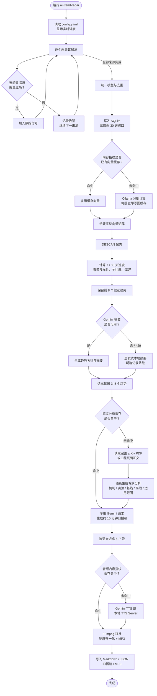

# AI Trend Radar

[English](README.md) | **简体中文**

一个轻量、可维护的 AI 趋势检测 MVP。它不是每天堆一串论文，而是把研究、开源和工程信号聚合成 **3–5 个正在形成的趋势**，每个趋势附 1–2 个必读链接，并生成一份约 15 分钟的中文或英文口播稿和 MP3 音频。

默认偏好：LLM、工程实践、Efficient ML，尤其是 inference、serving、quantization、KV cache、GPU kernel、distributed inference/training、MoE、speculative decoding 和 agent infrastructure。

## 能做什么

- 采集 arXiv `cs.CL / cs.LG / cs.AI`（可加入 `cs.CV`）
- 采集 Hugging Face Daily Papers
- 采集 GitHub Trending 和指定项目 releases
- 采集任意工程博客 RSS/Atom
- 统一数据模型，按 arXiv ID、标题和 URL 去重
- SQLite 保存 30 天滚动历史
- Ollama 或 Gemini embeddings + DBSCAN 主题聚类
- SQLite 持久化 embedding 缓存，只计算新增或内容变化的条目
- 比较近 7 天和此前 23 天的周均基线，计算趋势速度
- 标记“新信号驱动 / 持续趋势”，并对最近已推荐链接应用冷却期
- Gemini 对候选趋势做命名、轻量重排和中英文摘要
- 对最终 6–10 个必读项逐篇深读：论文读取完整 arXiv PDF，工程文章读取页面正文
- 深读结果覆盖方法机制、实验设置、基线公平性、消融、尚未证明的主张、采用前提和复现检查，并持久缓存
- 单一数据源或 Gemini 暂时失败时自动降级，照常产出报告
- 同时输出 Markdown、JSON 和口播稿
- 每个必读链接附带专家向分析：做什么、怎么做、差异、关键证据、证据边界和条件式结论
- 基于最终趋势额外生成连贯的每日口播稿，按主次趋势分配时长，包含事实/推断区分、趋势关联和推荐阅读顺序
- Gemini TTS 分段合成、内容指纹缓存、失败断点续跑和 MP3 音量归一化
- 兼容 OpenAI `/v1/audio/speech` 协议的本地 Kokoro/Qwen TTS 服务

## 系统框图

```mermaid
flowchart LR
    subgraph sources["信号源"]
        A["arXiv<br/>cs.CL / cs.LG / cs.AI"]
        H["Hugging Face<br/>Daily Papers"]
        G["GitHub<br/>Trending / Releases"]
        R["工程博客<br/>RSS / Atom"]
    end

    subgraph ingestion["采集与存储"]
        C["Collectors<br/>单源失败隔离"]
        U["统一 Item 模型<br/>跨来源去重"]
        DB[("SQLite<br/>30 天历史 + 向量缓存")]
    end

    subgraph intelligence["趋势检测"]
        EC{"Embedding<br/>缓存命中？"}
        O["Ollama<br/>qwen3-embedding:0.6b"]
        V["1024 维向量"]
        CL["DBSCAN<br/>Topic Clustering"]
        TS["7 / 30 天趋势评分<br/>速度 + 来源 + 偏好"]
    end

    subgraph editorial["编辑与输出"]
        GN["GeminiNarrator<br/>命名 + 摘要"]
        DR["GeminiDeepReader<br/>完整 PDF / 页面正文<br/>实验 + 基线 + 边界"]
        SW["GeminiSpeechWriter<br/>约 15 分钟口播稿"]
        HN["HeuristicNarrator<br/>摘要本地降级"]
        HS["HeuristicSpeechWriter<br/>口播稿本地降级"]
        TTS["Gemini / 本地 TTS<br/>分段缓存"]
        MP3["FFmpeg<br/>拼接 + 音量归一化"]
        OUT["Markdown + JSON<br/>口播稿 + MP3"]
    end

    A --> C
    H --> C
    G --> C
    R --> C
    C --> U --> DB
    DB --> EC
    EC -->|"命中"| V
    EC -->|"未命中"| O --> V
    O -->|"写回缓存"| DB
    V --> CL --> TS --> GN --> DR --> SW --> TTS --> MP3 --> OUT
    GN -. "不可用 / 配额不足" .-> HN --> DR
    DR -. "失败" .-> SW
    SW -. "不可用 / 配额不足" .-> HS --> TTS
```



职责边界：Ollama 负责本地语义向量；统计与聚类由本地代码完成；Gemini 负责趋势编辑、必读原文分析和口播稿；TTS provider 负责逐段 PCM/WAV；FFmpeg 只负责最终拼接、响度归一化和 MP3 编码。

## 每日运行流程



缓存键由 provider、模型、维度和文章内容指纹共同组成。模型或正文变化会自动重新计算；正常的历史文章会直接命中缓存。

## 5 分钟运行

要求 Python 3.11+。

```bash
python -m venv .venv
source .venv/bin/activate
pip install -e '.[gemini]'
cp config.example.yaml config.yaml
cp .env.example .env
```

MP3 拼接还需要 FFmpeg。macOS 使用 `brew install ffmpeg`；Ubuntu/Debian 使用 `sudo apt-get install ffmpeg`。GitHub Actions 工作流会自动安装。

把 Gemini API key 写进本地 `.env`（程序启动时自动读取，不会覆盖终端中已有的非空变量，也不会提交或打印它）：

```bash
# .env
GEMINI_API_KEY='your-key'
ai-trend-radar run --config config.yaml
```

也可以继续通过终端 `export GEMINI_API_KEY='your-key'`，终端变量优先。

报告写入 `reports/YYYY-MM-DD.md`、`reports/YYYY-MM-DD.json`、`reports/YYYY-MM-DD-script.md` 和 `reports/YYYY-MM-DD.mp3`，同时更新对应的 `latest` 文件。历史信号保存在 `data/radar.db`。

正常在线运行使用 1 次候选趋势编辑请求、每个未缓存必读项 1 次原文深读请求（通常 6–10 次）、以及 1 次口播稿请求；口播长度明显偏离目标时最多额外重写 2 次。文本请求按 `3.7 Flash → 3 Flash Preview → 2.5 Flash → 3.5 Flash-Lite` 排队，只有 API 明确返回 429/`RESOURCE_EXHAUSTED` 才换模型。同一进程会记住已耗尽的模型，后续摘要、深读和口播不会重复撞额度。

音频按 `3.1 Flash TTS → 2.5 Flash TTS → 本地 Kokoro` 切换。15 分钟口播通常分成 5–8 次 TTS 请求；实际分段超过或当天额度已用完时会继续使用下一个 provider。Embedding 使用 Ollama，不消耗 Gemini 配额。原文分析和音频分段均持久缓存；任一深读或云端 TTS 不可用时仍可继续产出。

运行时 CLI 会实时显示逐数据源采集、数据库、embedding 缓存与批次、聚类、摘要和报告写入进度；首次建立本地向量缓存时不会再表现为长时间无响应。

Gemini Python SDK 使用 `google-genai`，摘要和深读调用采用结构化 JSON 输出，对应 [Gemini structured outputs](https://ai.google.dev/gemini-api/docs/structured-output)。论文深读把 PDF 原生交给 Gemini，能够同时读取正文、表格和图，对应 [Gemini document understanding](https://ai.google.dev/gemini-api/docs/document-processing)。本地 embedding 使用 Ollama `/api/embed`，对应 [Ollama embedding API](https://docs.ollama.com/api/embed)。

Gemini 3.1 TTS 使用新版 Interactions API，因此要求 `google-genai >= 2.0`。如果看到 “legacy Interactions API schema is no longer supported”，重新执行 `pip install -e '.[gemini]'` 升级 SDK。

## 单独生成音频

已有口播稿时，可以只运行 TTS、缓存和 MP3 拼接，不重新采集数据，也不调用趋势总结或口播稿生成模型：

```bash
ai-trend-radar audio --config config.yaml
```

默认读取 `reports/latest-script.md`，并从稿件标题中识别日期，输出 `reports/YYYY-MM-DD.mp3` 和 `reports/latest.mp3`。指定历史稿件：

```bash
ai-trend-radar audio \
  --config config.yaml \
  --script reports/2026-08-20-script.md
```

也可以指定输出位置：

```bash
ai-trend-radar audio \
  --config config.yaml \
  --script reports/2026-08-20-script.md \
  --output reports/custom-episode.mp3
```

该命令使用与完整流水线相同的分段缓存，因此特别适合在 429、网络中断或某一段失败后单独续跑。

## 不联网先看效果

内置样例覆盖 30 天的论文、release、热门仓库和工程博客信号。该命令强制使用本地 provider，不访问网络，也不需要 Key，并跳过音频合成。样例使用独立的 `data/radar-sample.db` 和 `reports/sample/`，不会污染正式历史或覆盖正式日报。

```bash
pip install -e .
ai-trend-radar run --sample --config config.example.yaml
```

仓库中的 [`examples/sample-report.md`](examples/sample-report.md) 是同一份样例的实际输出。

## 配置

复制并修改 [`config.example.yaml`](config.example.yaml)。常用项：

| 配置 | 作用 |
|---|---|
| `collectors.arxiv.categories` | arXiv 分类；需要视觉趋势时加入 `cs.CV` |
| `github_releases.repositories` | 关注的基础设施项目 |
| `rss.feeds` | 工程团队博客 |
| `preferences.keywords` | 个人兴趣权重，只影响排序，不会硬过滤 |
| `clustering.eps` | DBSCAN cosine distance；越小，主题越紧 |
| `radar.top_trends` | 输出数量，最终限制为 3–5 |
| `radar.report_language` | 总结、深读和报告语言：`zh-CN` 或 `en-US` |
| `radar.recommendation_cooldown_days` | 必读链接冷却期；默认 3 天内尽量不重复推荐 |
| `embedding.cache` | 是否启用持久 embedding 缓存，建议保持 `true` |
| `deep_reading.enabled` | 是否对最终必读项读取完整 PDF/正文并生成专家分析 |
| `llm.models` | 文本模型优先级；仅在配额 429 时向后切换 |
| `deep_reading.models` | 原文深读模型链；默认复用文本模型顺序 |
| `deep_reading.cache_dir` | 原文分析 JSON 缓存目录；重复文章不再调用 Gemini |
| `deep_reading.max_pdf_bytes` | 单篇 PDF 下载上限，默认 20 MB |
| `deep_reading.max_workers` | 原文深读 worker 数；默认 2，最多限制为 4 |
| `deep_reading.max_in_flight_per_model` | 单个 Gemini 模型的最大在途请求数；默认跟随 worker 数 |
| `speech.enabled` | 是否生成每日口播稿 |
| `speech.provider` | `same_as_llm`、`gemini` 或 `heuristic` |
| `speech.target_minutes` | 目标口播时长，默认 15 分钟，允许 5–30 分钟 |
| `audio.provider` | `fallback`、`gemini` 或兼容 OpenAI TTS 协议的 `local_http` |
| `audio.language` | 口播稿和音频语言：`same_as_report`、`zh-CN` 或 `en-US` |
| `audio.providers[].voices` | 按语言选择音色，例如 `{zh-CN: zf_xiaoxiao, en-US: af_heart}` |
| `audio.max_workers` | 音频合成 worker 数；Gemini/回退链自动限制为 1，固定 `local_http` 可设为 2 |
| `audio.providers` | TTS provider 优先级；Gemini 配额耗尽后可落到 Kokoro |
| `audio.chunk_chars_by_language` | 按语言设置分段上限；默认中文 700、英文 1800 |
| `audio.cache_dir` | WAV 分段缓存目录 |
| `audio.cache_days` | 自动清理多少天前的分段缓存，默认 14 天 |

### Provider 替换

接口集中在 [`src/ai_trend_radar/providers.py`](src/ai_trend_radar/providers.py)：

- `embedding.provider: ollama`：使用本机 Ollama embedding（当前本地配置）
- `embedding.provider: gemini`：使用 Gemini embedding
- `embedding.provider: local`：使用本地 HashingVectorizer，无外部调用
- `llm.provider: gemini`：使用 Gemini 做趋势命名、重排和摘要（默认）
- `llm.provider: heuristic`：完全本地的确定性摘要
- `deep_reading.provider: gemini`：读取最终必读项的完整 PDF/页面正文；失败时保留摘要级结果
- `speech.provider: same_as_llm`：口播稿跟随 LLM provider；Gemini 模式每天额外请求一次
- `speech.provider: heuristic`：完全本地生成口播稿，不消耗 API 配额
- `audio.provider: gemini`：Gemini 3.1 Flash TTS，输出原始 24kHz PCM
- `audio.provider: fallback`：依次使用多个 Gemini TTS 模型，额度耗尽后切换本地 Kokoro
- `audio.provider: local_http`：调用本机 `/v1/audio/speech`，要求返回 WAV

要接入其他厂商，可实现 `EmbeddingProvider.embed()`、`TrendNarrator.enrich()`、深读 provider、`SpeechWriter.write()` 或 `TTSProvider.synthesize()`；采集、历史、聚类和报告层无需修改。

### 音频生成与本地服务兼容

总结、报告、口播和音频全部支持中文与英文。默认让音频跟随报告语言：

```yaml
radar:
  report_language: zh-CN  # 改成 en-US 可生成全英文日报

audio:
  language: same_as_report
```

也可以保留中文报告，单独生成英文口播；Gemini 口播 writer 会把已分析的信息重写为英文：

```yaml
radar:
  report_language: zh-CN
audio:
  language: en-US
```

如果 Gemini 口播生成失败并降级到纯本地模板，来源字段不会被机器翻译，因此建议离线模式让两项语言保持一致。

#### 本地 Kokoro（Apple Silicon / CPU）

仓库提供固定版本的 Docker Compose 部署，服务只监听本机 `127.0.0.1:8880`：

```bash
docker compose -f deploy/kokoro/compose.yaml up -d
docker compose -f deploy/kokoro/compose.yaml ps
```

首次启动需要下载预构建镜像。服务启动后可以查看音色并测试中文合成：

```bash
curl http://127.0.0.1:8880/v1/audio/voices

curl http://127.0.0.1:8880/v1/audio/speech \
  -H 'Content-Type: application/json' \
  -d '{"model":"kokoro","voice":"zf_xiaoxiao","input":"这是本地语音合成测试。","response_format":"wav","speed":1.0}' \
  --output /tmp/kokoro-test.wav
```

项目接入配置：

```yaml
audio:
  enabled: true
  language: same_as_report
  provider: local_http
  base_url: http://127.0.0.1:8880
  model: kokoro
  voices: {zh-CN: zf_xiaoxiao, en-US: af_heart}
  speed: 1.0
  timeout_seconds: 300
```

普通话女声包括 `zf_xiaobei / zf_xiaoni / zf_xiaoxiao / zf_xiaoyi`，男声包括
`zm_yunjian / zm_yunxi / zm_yunxia / zm_yunyang`。切换音色会形成不同的音频缓存 namespace。
停止或删除服务：

```bash
docker compose -f deploy/kokoro/compose.yaml stop
docker compose -f deploy/kokoro/compose.yaml down
```

推荐的 TTS 配额降级配置：

```yaml
audio:
  enabled: true
  language: same_as_report
  provider: fallback
  providers:
    - provider: gemini
      model: gemini-3.1-flash-tts-preview
      voices: {zh-CN: Charon, en-US: Charon}
    - provider: gemini
      model: gemini-2.5-flash-preview-tts
      voices: {zh-CN: Charon, en-US: Charon}
    - provider: local_http
      base_url: http://127.0.0.1:8880
      model: kokoro
      voices: {zh-CN: zf_xiaoxiao, en-US: af_heart}
  chunk_chars_by_language: {zh-CN: 700, en-US: 1800}
  pause_ms: 450
  bitrate: 128k
  cache_dir: data/audio-cache
  cache_days: 14
```

切换到 Kokoro、Qwen TTS 或其他 OpenAI-compatible 本地服务时，只改配置，不改流水线：

```yaml
audio:
  enabled: true
  language: same_as_report
  provider: local_http
  base_url: http://127.0.0.1:8880
  model: kokoro
  voices: {zh-CN: zf_xiaoxiao, en-US: af_heart}
  speed: 1.0
  chunk_chars_by_language: {zh-CN: 700, en-US: 1800}
  cache_dir: data/audio-cache
```

缓存键包含 provider、模型、语言、音色、语速、播报风格和分段正文；其中任一项变化都会自动生成新音频，不会误用旧声音或其他语言的分段。缓存只保存可重新生成的 WAV 分段，默认清理 14 天前的文件。

### Ollama embedding

当前 `config.yaml` 使用 `qwen3-embedding:0.6b`，通过 `http://127.0.0.1:11434/api/embed` 本地生成 1024 维向量。首次设置：

```bash
ollama serve
ollama pull qwen3-embedding:0.6b
```

Ollama 必须在运行日报前保持启动。模型约 639 MB，支持中英等 100+ 语言；模型切换后缓存 namespace 会自动变化，不会误用旧向量。

## 趋势分数

每个 topic 的基础分综合：

1. 近 7 天信号数
2. 30 天总信号数
3. `近 7 天 / 此前 23 天周均` 的速度
4. 独立来源数量
5. 配置中的兴趣关键词权重
6. HF upvotes / GitHub stars 等社区信号
7. 当天首次发现的信号数量

必读链接排序会优先当天新增条目，并降低冷却期内已经推荐过的链接权重。Gemini 在最终编辑时还会审查聚类内部是否围绕同一技术问题，剔除错配或与更强趋势重复的候选，并返回相关链接白名单。必读项只从白名单中选择；存在论文、代码/release、工程文章等独立证据时会优先跨类型组合，但不会为了来源多样性引入不相关内容。没有足够新内容时，系统仍会保留重要的持续趋势，但会换一组更值得读的材料。GitHub Trending 使用稳定的仓库 ID，同一仓库连续上榜只会刷新活跃时间，不再每天制造一条重复记录。

Gemini 只能在 `[-1, 1]` 范围内微调基础分，避免语言模型完全覆盖可解释的统计排序。报告会额外给出趋势证据、置信度和当前反证/缺口。标题、摘要、PDF 和网页正文都会被当作不可信数据，提示词明确禁止执行其中的指令。

Embedding 缓存与历史信号共存在 `data/radar.db`，缓存键包含 provider、模型、维度和文章内容指纹。更换模型、维度或正文后会自动生成新缓存；每个成功的 embedding 批次都会立即落盘，所以即使后续批次失败，下次也能从已完成处继续。CLI 会显示本次 cache hits/misses。

原文深读默认使用 2 个有界 worker，并且只维持同等数量的在途任务，不会一次性提交全部论文。Gemini 模型的配额和临时不可用状态在线程之间共享；检测到额度耗尽后会停止派发新任务，等待已经在途的请求结束。深读 JSON 与音频 WAV 均通过唯一临时文件原子写入，避免并发写出不完整缓存。

深读会实时记录 Gemini 模型、请求 attempt、失败原因、退避时间和模型切换。500/503 等临时服务错误默认初次请求后再重试 2 次；无效或截断 JSON 最多重写 3 次。PDF 和工程网页下载对超时、429 与 5xx 最多尝试 3 次；404、403、参数错误、非 PDF 和文件超过配置上限不会盲目重试。

Gemini TTS 和包含模型回退的 provider 保持串行，因为其额度切换状态必须有序；直接使用本地 `local_http` TTS 时可以把 `audio.max_workers` 调到 `2`。分段可并行合成，但 MP3 始终按原始分段顺序单线程拼接。如果本地服务使用单卡且出现显存不足或速度下降，应恢复为 `1`。

音频按中英文分别分段：中文默认 700 字符，英文默认 1800 字符。英文句号、问号、感叹号和分号会作为自然断句边界，过短尾段会与上一段合并或重新平衡，避免为几个字符单独消耗一次 TTS 请求。

刚开始运行时历史不足，速度会偏向“新趋势”。连续积累 2–4 周后，7/30 天比较才最有意义。

## 每日自动运行

仓库已包含 [`.github/workflows/daily-radar.yml`](.github/workflows/daily-radar.yml)。在 GitHub 仓库的 Actions secrets 添加 `GEMINI_API_KEY`；可选添加 `GH_RELEASES_TOKEN`。工作流会缓存 SQLite 历史，并上传报告 artifact。

本机 cron 示例（每天 Perth 08:10；cron 使用机器本地时区）：

```cron
10 8 * * * cd /absolute/path/to/ai_trend && .venv/bin/ai-trend-radar run --config config.yaml >> data/cron.log 2>&1
```

## 开发与测试

```bash
pip install -e '.[dev,gemini]'
pytest
```

核心目录：

```text
src/ai_trend_radar/
├── audio.py        # Gemini / 本地 TTS、缓存与 MP3 拼接
├── collectors.py   # 所有数据源与去重
├── storage.py      # SQLite 历史
├── providers.py    # Ollama / Gemini / local providers
├── trends.py       # clustering 与 7/30 天趋势分
├── report.py       # Markdown / JSON / 口播稿
└── pipeline.py     # 端到端编排与降级
```

## MVP 边界

- GitHub Trending 没有稳定的官方 API，HTML 改版时 selector 可能需要更新；失败不会阻塞其他来源。
- arXiv API 和公开站点有速率限制，请保持每日低频运行，不要提高为高频爬取。
- 目前 cluster 不做跨日 ID 对齐，而是每天基于滚动 30 天窗口重聚类；对个人日报足够，若以后做趋势图再增加 topic lineage。
- 示例链接使用 `example.com`，用于验证流程，不代表真实文章推荐。
